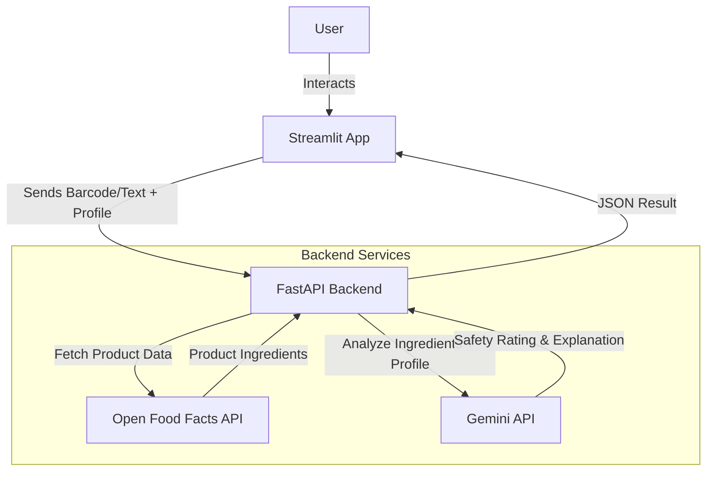

# BioFilter Design Document

## 1. Overview
BioFilter is a consumer health application designed to decode food labels based on personalized user bio-profiles. It aims to provide clarity and safety for users with specific dietary needs or allergies.

## 2. User Experience (UX)

### User Flow
1.  **Onboarding/Profile**:
    -   User opens the app.
    -   Selects "Filter Rules": Allergies (Nuts, Dairy, Gluten) and Dietary Goals (Keto, Vegan, Low-Sugar).
    -   Sets "Strictness Level" (Strict vs. Flexible).
2.  **Scanning**:
    -   User navigates to the "Scan" tab.
    -   Scans a barcode (using camera or manual entry).
    -   *Alternative*: Takes a photo of the ingredient list (OCR fallback).
3.  **Analysis & Results**:
    -   App displays a "Traffic Light" result:
        -   🟢 **Green**: Safe / Matches goals.
        -   🟡 **Yellow**: Caution (e.g., high sugar for diabetic).
        -   🔴 **Red**: Danger / Conflict (e.g., contains allergen).
    -   **Explanation**: A 1-sentence plain-English reason (e.g., "Contains Honey which is not Vegan").
    -   **Reboot/Alternative**: If Red/Yellow, suggests a better product.

## 3. Architecture



## 4. Component Design

### Frontend (Streamlit)
-   **`app.py`**: Navigation and main layout.
-   **State Management**: `st.session_state` to hold User Profile and last Scan Result.
-   **Input**: `st.camera_input` for simplistic barcode scanning (or specialized component), `st.text_input` fallback.

### Backend (FastAPI)
-   **`/scan` Endpoint**:
    -   Input: `{ barcode: str, user_profile: dict }`
    -   Process:
        1.  Call Open Food Facts with barcode.
        2.  Extract ingredient text.
        3.  Construct prompt for Gemini: "Analyze these ingredients [X] against constraints [Y]. Return Green/Yellow/Red and explanation."
        4.  Return structured JSON.

## 5. Data Model
**User Profile**:
```json
{
  "allergies": ["Peanuts", "Shellfish"],
  "diets": ["Low-Carb"],
  "strictness": "Strict"
}
```

**Scan Result**:
```json
{
  "status": "Red",
  "reason": "Contains Peanuts.",
  "alternative": "Try 'SafeNut Bar' instead."
}
```
